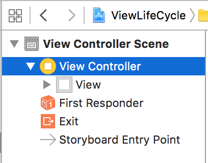
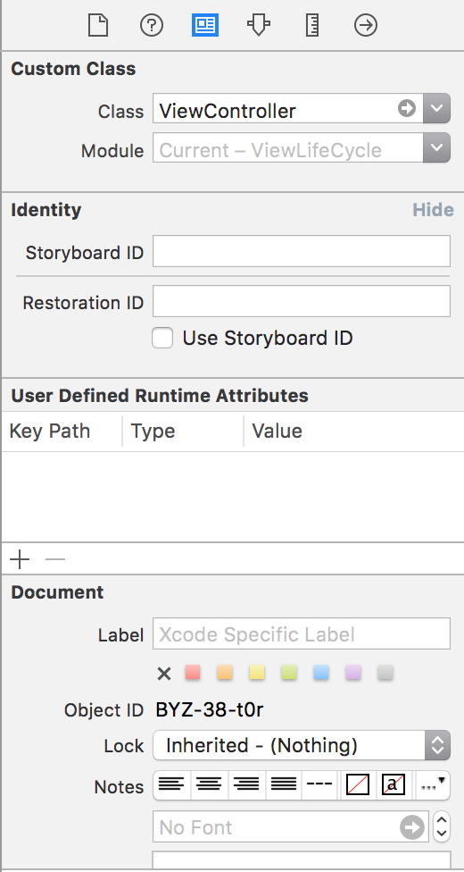
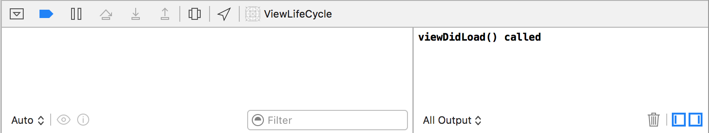
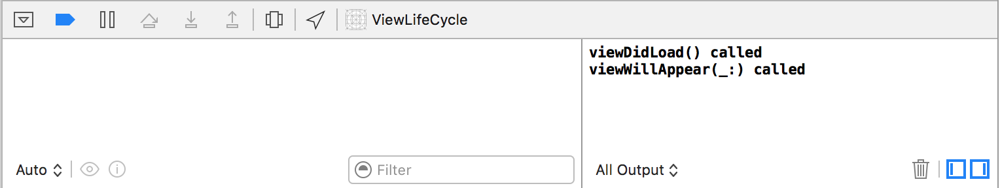
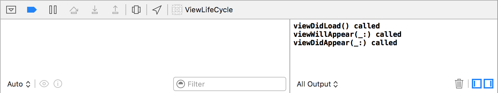

# View Lifecycle


> Keep away from people who try to belittle your ambitions. Small people always do that, but the really great make you feel that you, too, can become great. 

## Learning Objectives - The student should be able to...

* Navigate to the View Controller Scene in the `Main.storyboard` file.
* Understand that we need to connect our View Controller (which contains movie buttons) to a `.swift` file (our code). We need to make a connection between the visual elements of our application with a `.swift` file where we can write code and react to what the user is doing.
* Create the connection between the View Controller in the `Main.storyboard` file with the `ViewController.swift` file by selecting the View Controller (in the `Main.storyboard` file) then setting its Class in the Identity Inspector to be the `ViewController.swift` file.
* Explain that the `View` object they can select/modify within the View Controller Scene is directly tied with the `viewDidLoad()` method.
* Explain that the `viewDidLoad()` is called after the view controller has loaded its view into memory.
* Explain that the `view` is not visible to the user within the scope of the `viewDidLoad()` method (the view has been loaded into memory, it just hasn't displayed itself to the user...yet) which allows for _you_ (the developer) to perform any additional steps.
* Explain that the `viewWillAppear(_:)` and `viewDidAppear(_:)` methods are called every time your view controller is moved onscreen.
* Explain that the `viewDillDisappear(_:)` and `viewDidDisappear(_:)` methods get called every time your view controller is moved offscreen.
* Change the `backgroundColor` of the `view` in the `viewDidLoad()` method:  
```swift  
view.backgroundColor = UIColor.grayColor()
```

## What the student can do at this point 

* Has a general overview of Xcode and is able to create a new project.
* Knows where to locate the testing file within Xcode.
* Knows how to navigate to Interface Builder.
* Knows what a storyboard file is.
* Has a brief overview of what the Object Library is.
* Can drag a View Controller onto the canvas.
* Can locate and drag items from the Object Library.
* Can locate the Attributes Inspector and change the Background color of Views

## View Lifecycle

So far, you've learned how to create graphical user interfaces for your iOS apps in Xcode. You've probably noticed, though, that your graphical interfaces don't actually do anything. You haven't written any Swift code to make your interface _work_. It's just some labels and buttons!

You've probably noticed, however, that in every interface, the firs thing you've dragged into the canvas is a _view controller_. Far from just being a blank white rectangle on the Interface Builder canvas, that view controller is actually a key piece of the puzzle: It contains the code that makes a view _do something_.

Take a look at your file listing. You should see a file called `ViewController.swift`. This is created as part of every new iOS project. It is the code portion of that main view controller you've been creating in every app. By default, it doesn't do anything useful, but that's about to change.


But before we get started writing code, let's talk about how your application creates views.

When a user launches your application, the first thing the application needs to do is display the initial view of the application. It looks at the main storyboard file to find the initial view controller. It then creates that view controller, and calls a few methods on it to initialize it. The view controller, in turn, will often do a bit of initialization to its view and any subviews. Finally, after all that loading, the view is drawn to the screen and displayed to the user. This process is known as the _view life cycle_.

Whoo! That was a lot to digest at once, so let's take it piece by piece.

First, take a look at the `Main.storyboard` file. It has a pretty simple interface consisting of four movie poster thumbnails and a piece of film trivia.


How does that view get associated with a view controller?

It may seem like magic, but it's actually pretty straightforward. Select the **View Controller** in the object listing.



Bring up the view controller's Attribute Inspector.

The first section of the Attributes Inspector is called **Custom Class*. This is where you associate a view controller with its corresponding code.



By default, the **Custom Class** is already set to **ViewController**. This means that the selected view controller is associated with the code in the `ViewController.swift` file, which means that the code you write in that file will determine how the view controller behaves and responds to input, and draws things to the screen.

Click the grey arrow next to **ViewController** in the **Custom Class** dropdown menu to open `ViewController.swift`.

See? The fact that clicking on the grey arrow opened `ViewController.swift` demonstrates that these two items—the view controller in `Main.storyboard` and the `ViewController.swift` file—are tied together. They are associated with each other.

Right now, `ViewController.swift` is pretty barren:

```swift
//  ViewController.swift


import UIKit


class ViewController: UIViewController {
    override func viewDidLoad() {
        super.viewDidLoad()
    }
}
```

There is one class, `ViewController`, which represents the view controller in the `Main.storyboard` file. That class contains one method, `viewDidLoad()`, which doesn't do much right now.

### `viewDidLoad()`

Remember when we talked about how your application is loaded when the user launches it? `viewDidLoad()` is one of the initialization methods that is called on the initial view controller. `viewDidLoad()` is called _before_ anything is shown to the user. It gives your app a chance to set some initial configuration in the view, and do some other minor tasks before the view is shown to the user for the first time. When `viewDidLoad()` is called, the view has been created _in memory_, but it has not yet been displayed.

To see this in action, add a `print()` call to the existing `viewDidLoad()` method, after the call to `super()`. Have it print something like "viewDidLoad() called":

```swift
override func viewDidLoad() {
    super.viewDidLoad()
    print("viewDidLoad() called")
}
```

Now, build and run your app in the simulator. You'll see the debugger output pane pop open at the bottom of Xcode's editor. Notice that right before the view appears, you'll see the message "viewDidLoad() called" logged to the console.



### `viewWillAppear(_:)`

When launching an app and initializing the views, `viewDidLoad()` is the first of several methods called. Once the view has actually been loaded (into memory, from the `.storyboad` file), the Cocoa Touch framework will then call `viewWillAppear(_:)`. This method is called when the view is about to _appear_ (be shown on the screen), but before it is actually displayed. This method allows you to do some further customization.

By default, your view controller will not override this method. You can add it yourself, though, and it will get called. Add a `viewWillAppear(_:)` method that prints "viewWillAppear(_:) called" to the console. Your complete `ViewController` implementation should look like this when you're done:

```swift
class ViewController: UIViewController {
    override func viewDidLoad() {
        super.viewDidLoad()
        print("viewDidLoad() called")
    }

    override func viewWillAppear(animated: Bool) {
        super.viewWillAppear(animated)
        print("viewWillAppear(_:) called")
    }
}
```

Build and run your application again. Take note of when these two messages (the one for `viewDidLoad()`, and the one for `viewWillAppear(_:)`) are called.



Take note of the order in which these methods were called. `viewDidLoad()` was called _first_, followed by `willWillAppear(_:)`.

If both these methods are called, what's the difference between the two? `viewDidLoad()` is only called _once_, when the view is loaded from a `.storyboard` file. `viewWillAppear(_:)` is called _every time_ the view appears. In this simple apps, that means it is only called once. However, imagine your app has several views, and you can move between them. `viewWillAppear(_:)` is called every time your view is displayed. `viewDidLoad()` is used for initialization that only has to occur once, wherehas `viewWillAppear(_:)` is used for initialization that occurs every time your view is displayed. As you start to write more complicated iOS apps, the differences between the two methods will become much more apparent.

### `viewDidAppear(_:)`

There is one final method called when your view is being displayed to the user: `viewDidAppear(_:)`. This method is called _after_ the view is shown to the user. If you change something inside this method (such as animating an image or a piece of text), the user _will_ see it change.

Like `viewWillAppear(_:)`, `viewDidAppear(_:)` is not defined in your view controller by default, but you can add it. Add a definition of `viewDidAppear(_:)` that prints a message to the console. Your complete implementation of `ViewController` should now look like this:

```swift
class ViewController: UIViewController {
    override func viewDidLoad() {
        super.viewDidLoad()
        print("viewDidLoad() called")
    }

    override func viewWillAppear(animated: Bool) {
        super.viewWillAppear(animated)
        print("viewWillAppear(_:) called")
    }

    override func viewDidAppear(animated: Bool) {
        super.viewDidAppear(animated)
        print("viewDidAppear(_:) called")
    }
}
```

Build and run your application again. Like before, pay careful attention to the messages in the debugging console. What order do you expect them to appear in? You should see output like this:



## Putting It Together

Now that you have an understanding of the view life cycle, let's demonstrate it in a more practical manner: By changing the color of the view's background color. You can already do that manually in the view's Attributes Inspector, but wouldn't it be more fun to set the background to a random color every time you launch the app? Of course it would be!

You can change the background color to a random color with a simple line of code:

```swift
view.backgroundColor = UIColor.randomColor()
```

Which method should you put this line of code in, though?

If you put it in `viewDidAppear(_:)`, the user will first see the white background color, and then the random color will "pop" in. Go ahead and try it! You probably want the user to see the random color right from the get-go, though, so `viewDidAppear(_:)` is probably not the right option.

What happens if you put it in `viewWillAppear(_:)`? Try it out. You won't see the random color "pop" in anymore. Mission accomplished, right? The only problem with putting the code in `viewWillAppear(_:)` is that the background color will change _every time_ the view appears. In this simple app, that only occurs once, but in a more complicated app with multiple screens, it would mean the user would see a new color every time they navigated back to this screen.

That may be what you want, but you can also consider putting the code that sets the background color in `viewDidLoad()`. This will change the background color once, when the view is loaded. Try putting the code there. Your complete implementation of `ViewController` will look like this:

```swift
class ViewController: UIViewController {
    override func viewDidLoad() {
        super.viewDidLoad()
        print("viewDidLoad() called")
        view.backgroundColor = UIColor.randomColor()
    }

    override func viewWillAppear(animated: Bool) {
        super.viewWillAppear(animated)
        print("viewWillAppear(_:) called")
    }

    override func viewDidAppear(animated: Bool) {
        super.viewDidAppear(animated)
        print("viewDidAppear(_:) called")
    }
}
```

Try building and running your application several times to see what colors you get!

One thing to note before ending the lesson: The line of code that changed the background color referenced a variable called `view`.

```swift
view.backgroundColor = UIColor.randomColor()
```

`view` is an _instance variable_ that is a part of every view controller. You'll learn more about this in later lessons, but it's important to note that the variable `view` is not random or magical; it's just an instance variable.

<a href='https://learn.co/lessons/ViewLifeCycle' data-visibility='hidden'>View this lesson on Learn.co</a>